# Project Mediation App

This project is based on a need for streamlining the divorce or separation process. This is the development diary of the process.

## Day 1 - 5th February 2018

To recap what I've worked on up until this point - On Saturday I was working through a logo idea - we have two names in contention - 1. SplitPea and 2. MediateMe. 1 has a more aesthetic concept, and 2 has more of a ring to it.

On satruday I roughly sketched out the splash page for the application, initially as SplitPea. Yesterday I thought that perhaps it might work well by using the same aesthetic as SplitPea, but instead of 'peas' there are still emojis, they are just blue instead. Below are the two options:

I'm torn! I like the green, but I like the ring of the MediateMe too. Both circular critters are cute and I think give the brand a more playful child-like edge which is essentially the purpose of this project - to keep the children in mind.

The two splash pages are as follows:

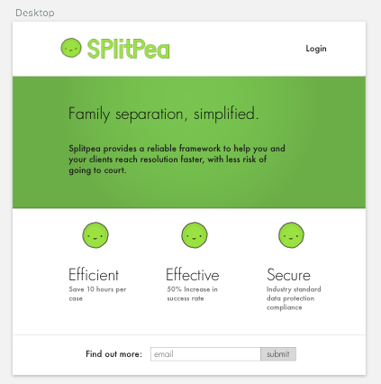

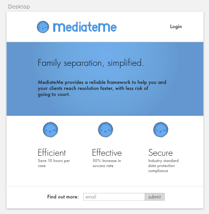

### Today's Objective

Now there's a basic aesthetic going, whichever one is chosen, I think clarity on the user journey as far as wireframes is the best place to start. At the moment they might not look like much - just text on a page, but the entirety of the app should be plotted out. Once this is done, and know how each page feeds into the other, we can start to fill each page in with designs and see how the flow works on a deeper level. This may take a few days to work though, but this is today's aim. I'll plot this out visually using sketch, so that if I get taken by a particular passage of thinking, it won't take too much to fill it out with more details.

If I get bored of the process thinking, I might design some little blue critters this evening.

#### The thinking

So I think I'll start with the mediator wireframes, simply because without the mediator, at least initially, there will be no partners, and that's how they will be invited into the system. For this we need:

- Mediator login page
- Case CRUD
- User CRUD

So I've worked through the login pages, and the case indexes. See below. 

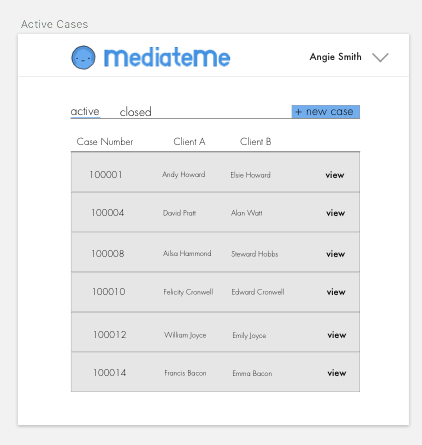

I'm now thinking about how best to display the case data to the mediator.

## Day 2 - 6th February 2018

Today I'm going to focus on the user show page - at the moment we're still looking at everything from the view of the mediator, as that will need the most funtionality - for users we can just hide things where appropriate. Probably I'll lay out all of the information for now, only to review later. The aim of today is to complete all of the mediator account views, and hopefully move onto the user account views by this evening. Image below is the progress of the client profile page from yesterday.

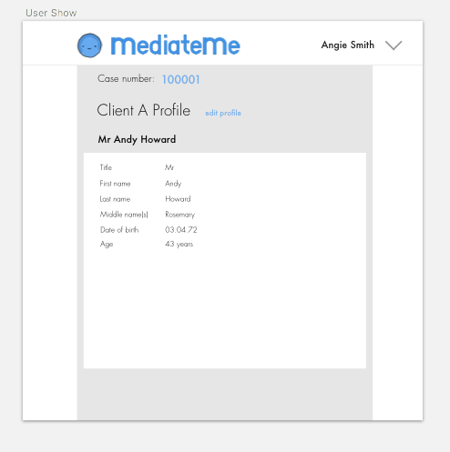

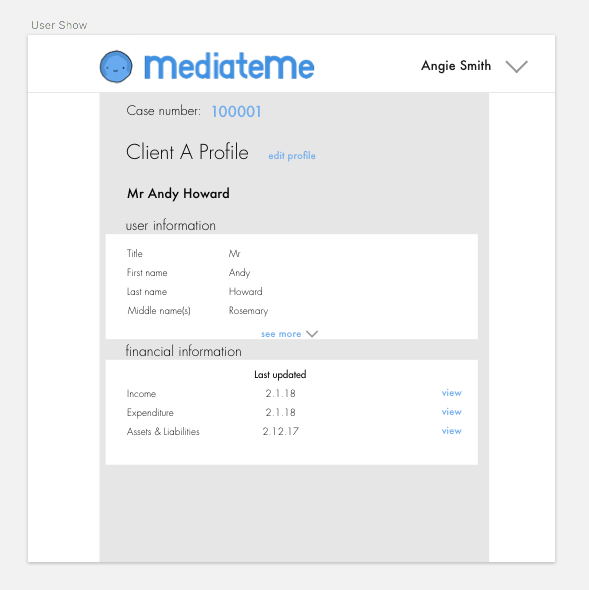

## Day 3 - 7th February 2018

Today I extended the case profile, and dug deeper in to the finances:

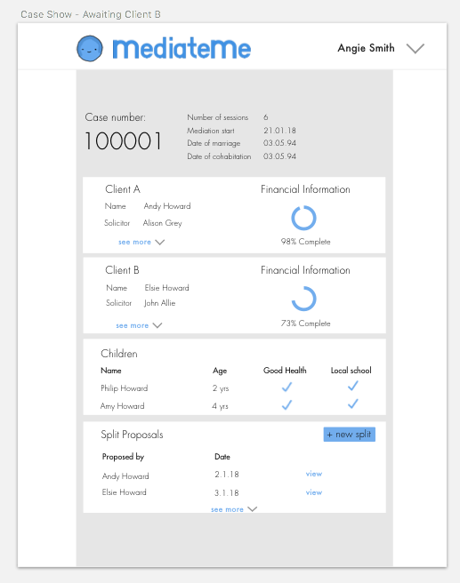

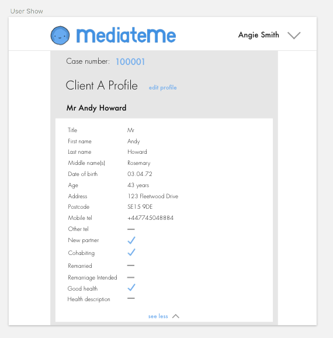

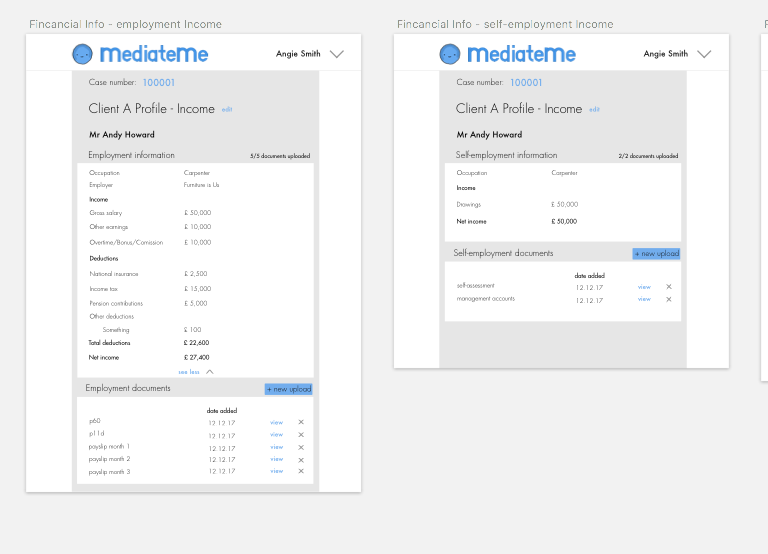

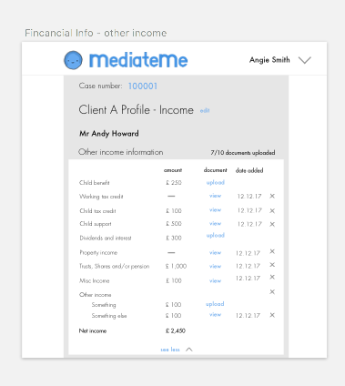

## Day 4 - 8th February 2018

Today I'm going to review the progress thus far and decide on design decisions that I've made, or need to make. It's a review of the short sprint that has been made. I'll also speak to the client to see how they are feeling about the designs so far.

The main 'to do' items at the moment are as follows:

- a way of representing when a client hasn't filled in the referral form, and perhaps a progress bar attached to that
- mediators should be able to edit any of the entries? perhaps, though the edit should be logged
- deciding where the attachements should be placed is an important point, and will be decided based on what additional information needs to go alongside them - probably quite detailed instructions about what is needed will be required here
- be good to establish how the 'split' process works, so we can best mimic that - probably with something like a wizard?
- is the best way of displaying all of the information in a list with expandable areas, like it is at present, or should the screen be split into two - with main headers on the left, and figures on the right? Only issue with this is when migrating to mobile or tablet this might be harder, though could possibly make use of the hierarchical menu (similar to the iPod from yesteryear....)

Call with M:

- Look into a coulour scheme that works 
- good health for children, not right - health, then tick for good, asterisk for information
- split proposals should only be editable by the mediator and called 'option 1', 'option 2'
- expenditure - no documents needed so much more simple

## Day 5 - 9th February 2018

Ok so key today is to NAIL the finance and split wizards so we have at least a line in the stand from which we can refer to.

Ok the financial wizard has been blocked out. Kinda hard to know whether it will be useful or annoying to use in this format - here are the steps:

### 1

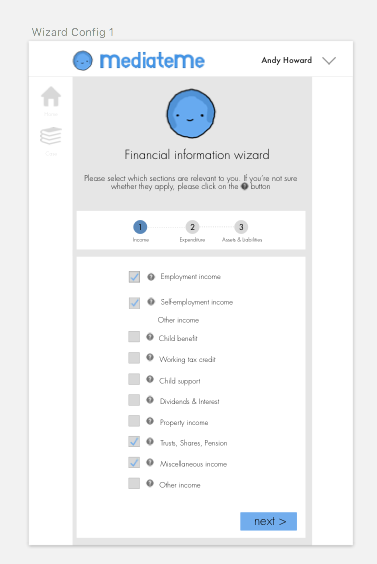

### 2

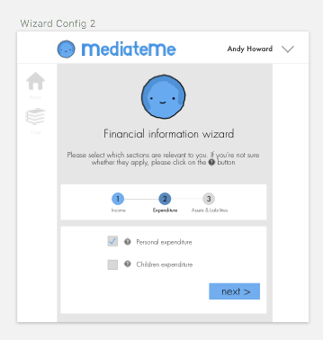

### 3

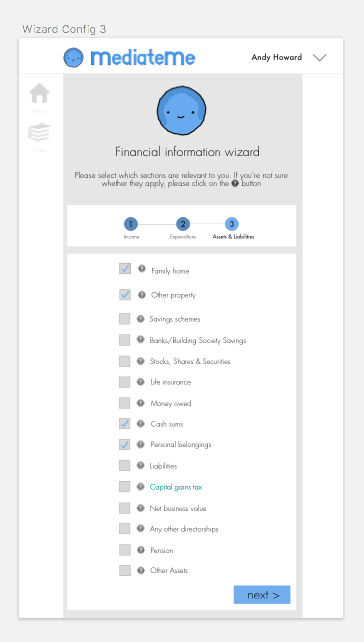

### 4

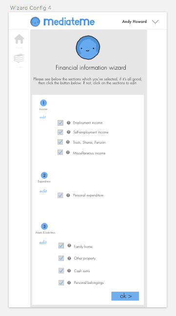

### 5

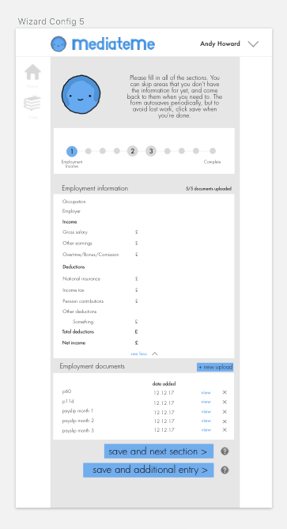

### 6

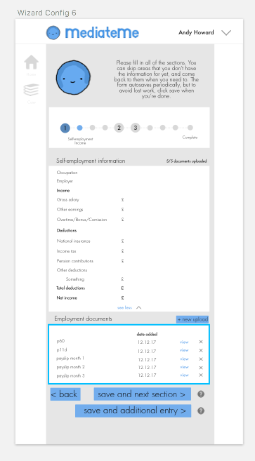

I've also added some side navigation icons to quickly navigate through the site - perhaps they'll not be needed, but I felt that when the user is within the wizard, they need a way of getting back to the main page.

Ok so quickly drafted a split wizard - think it's looking pretty neat. The main thing I need to work out is how to manage the duplicates. That's something that'll need to be worked out on a walk or something.

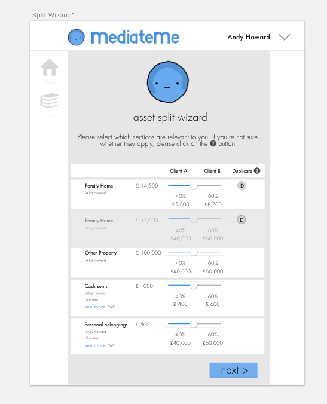

Ok so didn't go for a walk, and not totally sure this is optimum, but basically the duplicate button acts as a mute, and turns off this entry. The user can have the option to turn it off for all subsequent split drafts too. Perhaps this will be annoying to implement but it's the clearest way I can think of doing it at this moment.

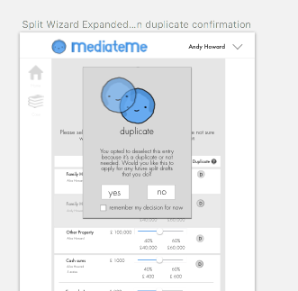

I've added a total section at the bottom which should negate the need of a 'summary' page.

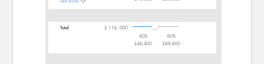

## Weekend - 10th February 2018

Call w/ client:

- Take out expenditure section as part of the wizard set-up section
- financial information wizard - take away the check summary - or augment it with documents required
- Remove numbers in the step by step (big circles)
- Re-think duplicate templates - like when there are two additional houses for example
- Question marks over everything
- Account number and date
- Add an interim stage which agrees all of the assets and then we go onto splits

## Day 6 - 12th February 2018

Over the weekend I played around with some illustrations using my new graphics pad - kinda happy with how they came out - can decide whether they are good enough for the final design later:

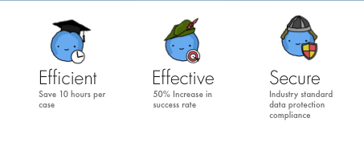

As for today - I need to nail the entire of the site structure to ensure that there are no missing pieces of the jigsaw by the time the friday deadline of locking in all of the site designs comes around. Not entirely sure the best way of mapping this all out visually as it's the first time I've done something like this - probably a bit of trial and error will be the best way.

Probably I'll do it here first, then will probably simply use the sketch pages I've designed to plot it out....perhaps that will come up against issues when needing to render off the entire diagram to discuss. In which case, omnigraffle may be the best, simply because I have used it in the past. I'll have a play with it later.

First, we'll start with the mediator flow, then move onto the user flow. I'll have a call with M to decide whether we need a solicitor flow.

#### - Mediator flow

1. Landing page
	- Login
	- Info
	- Email capture
	- Links to:
		- About us
		- Careers/Jobs
		- Apply to be a registered solicitor
		- Apply to be a registered mediator
		- Terms & Conditions

2. Login page
3. Case index
	- New case
	- Active cases
	- Closed cases
4. Case show
	- Case info
	- Client A info
		- personal information (and completion percentage)
		- financial information (and completion percentage)
		- solicitor information (and completion percentage)
	- Client B info
		- personal information (and completion percentage)
		- financial information (and completion percentage)
		- solicitor information (and completion percentage)

	- Consolidated financial information
		- Draft - mediator can choose to make this visible in the clients' accounts
		- Finalized
	- Splits
		- Drafts - mediator can choose to make these visible in the clients' accounts
		- Finalized 	
5. Compose MOU
	- TBD

#### - User flow

Client A

1. Recieve email
2. Navigate to website and asked to give password
3. Fill in referral form
4. View case profile with the step by step process visible
5. Fill in the financial information
6. Rest of the process is like the mediator's but with more restrictions on visibility

Client B

1. Recieve email
2. Navigate to website and asked to give password
3. Fill in referral form
4. View case profile with the step by step process visible (will it be ok to take Client A's case information, or will there be conflicting figures? so we need to reconcile this at all?)
5. Fill in the financial information
6. Rest of the process is like the mediator's but with more restrictions on visibility

#### - Solicitor flow

Possibly not relevant for MVP, but worth working out whether it's appropriate or not.

## Day 7 - 13th February 2018

So, having designed a really rough 'case show' page which updates the additional steps that have been outlined above (namely financial summary, split proposals and MoU Generation). See below. This leads us smoothly into needing an appropriate mechanic for the Financial Summary and MoU Generation.

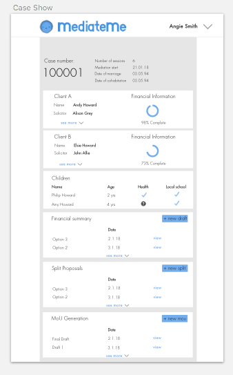
 

##Day 8

Waiting on a call to go over the last three remaining sections:
- Mou generation mechanic
- Income and expenditure integration
- Integration level of solicitors for MVP

##Day 9

Call overview:

- MOU generation - how does this work in practice
       - fall back is just generating with no editable features
       - ideally the MOU should be editable inline - I'll build a design which allows for this
- Income and expenditure
       - think of the best way of implementing - it needs to be alongside the assets but under a different tab perhaps
- How do solicitors plug into the system?
       - build it as if legal advice will be given, but that functionality doesn't need to be there front-end for now
       - Include notes section on every asset to future proof
       - Include section for mediator notes and mortgage ability

##Day 10

Today I'm going to tie up all of the loose ends from the designs - polish some in places where it is needed, and add the additional functionality discussed on the call yesterday. This should set me up nicely for next week where I'll re-engege with the back-end API and get that up and running.

*Note to self* - as I'm working through the MOU wizard, I'm picking up some bits and bobs that might be nice to integrate into the case show page - as mediator information of some sort. I'm noting this here so I don't forget. Particularly the arrangements with the children - be nice to have this part of the MoU prepopulated.

##Day 13

Today it's all about starting with the back-end database, and the API that the front-end will use.

The designs aren't 100% finished, but are complete to the level required to code the system.

The database structure is important now, and one that has been mapped out into quite some detail already in the past iterations. Now it's key to go through it all with a fine tooth comb and get it nailed. This may take the most of today to get right - although I'd hope to also get the SQL built so that it can be plugged into the API tomorrow, which will take a day or so to set up, with the routes getting added on Wednesday. If I work with ultimate focus I should be able to deploy the API on thursday, leaving friday to mop everything up and test the server part of the site - should be super exciting. 

## Day 14

In the end, I made some significant progress here, but not quite complete - need to decide whether I use JSON in some of the fields which get repeated, or if I need to access some fields within the JSON fields specifically, then I should perhaps do the work of putting all of those JSON fields into SQL tables.

Ok something that I've thought of while working through this SQL and getting a schema that will work neatly with all of these nested documents is once the partners submit a financial summary that is final, they can't go back and amend it. Any updated figures need to be given to the mediator to edit their end. Why is this? It adds complexity and isn't worth focussing on for the MVP.

Ok so today I've worked through the schema in a way that I think is pretty workable and I'm pretty happy with it. It's inevitably going to need some tweaking over the course of time but it's a good basis to start I think. I've ended up not relying on JSON in many areas, other than some fields where multiple mortgages might be required, but in reality infrequenly will. I may decide to jettison even those fields for a less exception-based table format.

The focus tomorrow is on implementing an API so that all of the routes and endpoints work as expected. It's worth now just working out exactly what the plan for this API is, what kind of requests the front-end is going to ask for, and how they might be provided.

Initially, authentication is something that will need to be integrated - something that I'll have to work through tomorrow when I've looked through the code. I've decided that separate log-in sections for Solicitors, Mediators and Clients might be good, to keep everything super separate.

So, aside from Authentication - what is needed?

Well, it's a pretty standard process of CRUD for each of the record types I think, being able to manipulate all of those from the front-end is important - at least initially - some unused routes can be deprecated later. So what do we have?

#### Client 
	- Create
	- Read
	- Update
	- Delete
#### Case
##### 	Case
	- Create
	- Read
	- Update
	- Delete
##### 	SplitOrSummaryHub
	- Create
	- Read
	- Update
	- Delete
##### 	SplitOrSummaryAsset
	- Create
	- Read
	- Update
	- Delete
##### Children
	- Create
	- Read
	- Update
	- Delete
##### MoU
	- Create
	- Read
	- Update
	- Delete
#### Mediator
	- Create
	- Read
	- Update
	- Delete
#### Finance
##### 	AssetClass
		- Create
		- Read
		- Update
		- Delete
##### 	Attachments
		- Create
		- Read
		- Update
		- Delete
##### 	Finance
		- Create
		- Read
		- Update
		- Delete
#### Solicitor
	- Create
	- Read
	- Update
	- Delete 

Looks like a lot but it should involve a lot of the same code over and over with subtle differences, it might also turn out that some of it isn't needed.

The focus for tomorrow will be getting all of these end points up and running and operational WITHOUT the authentication. I'll then layer on top the authentication on Thursday to ensure that it all works like it should. Some seed data tomorrow might be a nice idea too. 

Plotting out tomorrow's activity has got me excited because I can really see how this API is going to neatly slot together, and I'm very happy that I have worked on the database structure in this way. Means we'll have minimal mess in the future. A good day - and looking forward to an even better one tomorrow.

## Day 15

Ok so after a slow start today, got some good stuff done. It's 12.48am now so think it's time to sleep. All of the routes are done except the case routes, which should be pretty straight forward to polish off tomorrow. Looking forward to it. Once they are done, will layer on top the various authentication for the different users - which should be pretty much baked in anyway, but need to be mindful of which users can access which data - only if they have a JWT token can they access data, and even then only the user ID contained within the JWT token can be accessed. Although this is a subject to dive into tomorrow.

I'd love to be able to finish the API tomorrow for deployment on Friday - that would leave us in a super good position going into next week where we'd start on the front-end build sprint which would hopefully take two weeks. And then poof! It might well be done and dusted!

Fingers and toes crossed....

## Day 16

Ok so today I need to finish off the case crud routes, test them all, make sure they are all working as they should, and then move onto building in the authentication layer. 

I'll cover off all the routes first then come back here to plan out how the authentication layer is going to work.

So, quickly I'm just going to do a brain scan to see if there is any other functionality that I need to be working on beyond what has been mentioned here. I don't think so - though the DB doesn't have things like ability to store where in the wizard the user was, but that's a simple fix and requires no more logic to build out. I think we're pretty much there.

I think I'm going to leave the MOU routes for now, because I haven't had the wizard signed off and it might affect how I am going to create that part of the database. Hmm, I'll do a super basic one now though while I'm in the flow, so when I come back to it i'll just have to add the extra fields.

## Day 17

Users shouldn't be able to access each other's data - mediators, solicitors or clients, but at the moment they can. The best way to address this is have the route controller function look at the jwt token in the request header, take the ID, and only return records which relate to that ID. Any record that doesn't contain the ID that was presented, and isn't a 'sub-record' (i.e. a record which is connected to a parent, which may have a valid ID), will not be shown. The main thing here to double check that in order to get the user's ID from the JWT token, the secret is required. If the secret is required then it's important to have that in somewhere secure. On this basis, thinking about it - this is why the github should now no longer be public - could wait a little longer, but probably sensible to do it from now to be sure.

Auth is working for one of the routes in a minor way - need to go through all three levels of user type and work out which can view and do what with each record. This is probably best done here, and then implemented in code. Nice to have one route working with Mediator to ensure that it's straight forward enough.